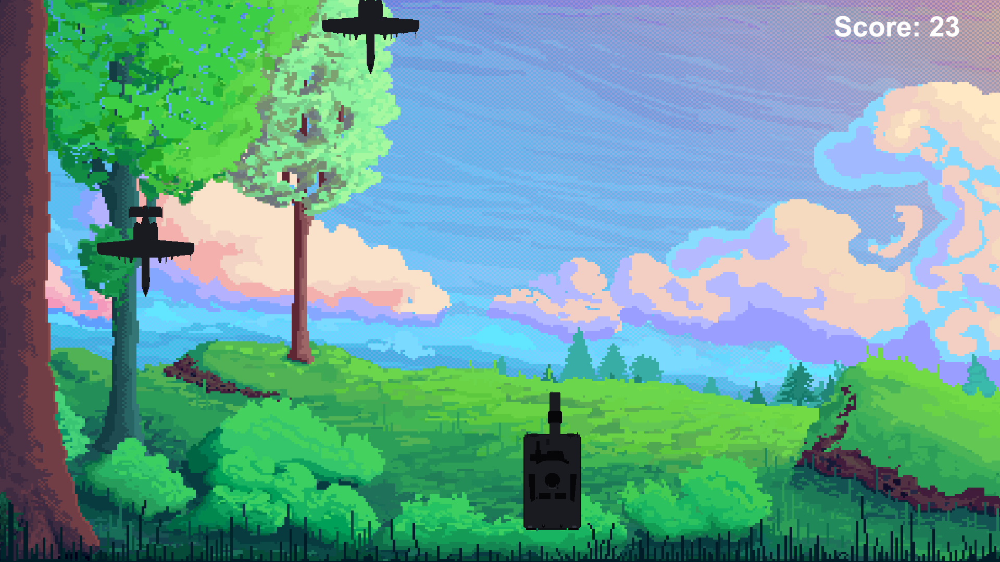
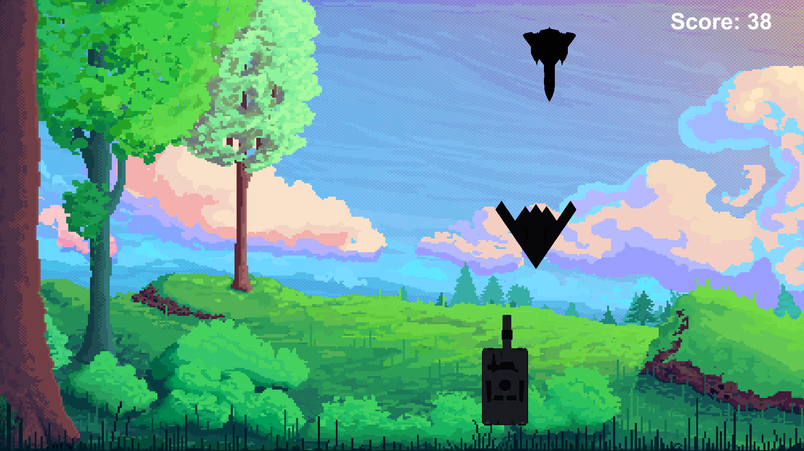
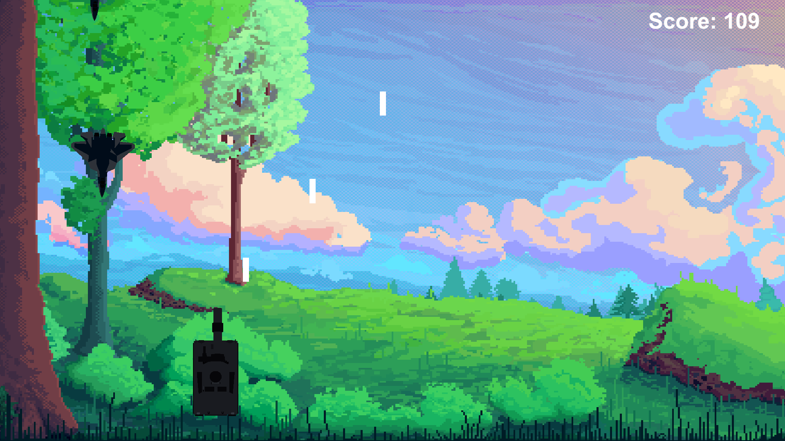
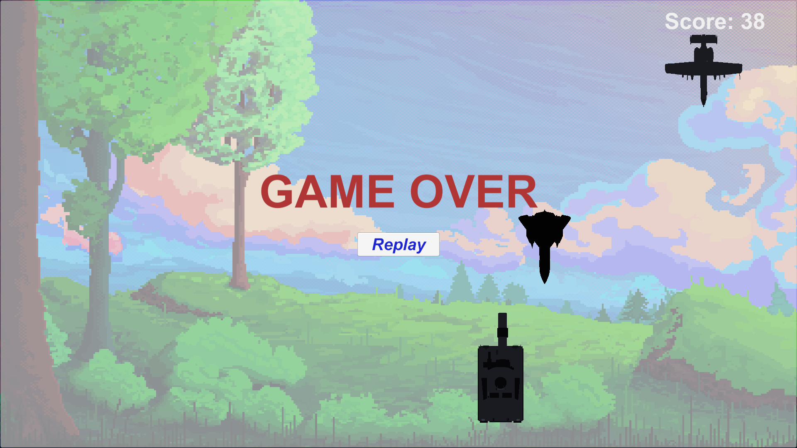

# MayBay2D
 BanMayBay2D

Mô tả
 - Game giải trí 2D Bắn máy bay
 - Game được thiết kế và xử lý thông qua Unity.
 - Người chơi sẽ di chuyển xe tăng sang trái, sang phải bằng các phím A và D trên bàn phím máy tính, chuột trái để bắn đạn.
 - Di chuyển đến trước mặt máy bay và bắn.
 - Có nhiều loại máy bay được sinh ra ở vị trí ngẫu nhiên trên bản đồ.
 - Mỗi loại máy bay sẽ có số điểm khác nhau tiêu diện máy bay sẽ được cộng số điểm đó.
 - Va vào máy bay và máy bay bay qua xe tăng sẽ Thua.
   
Một số hình ảnh trong Game.
<table>
  <tr>
    <td></td>
    <td></td>
  </tr>
  <tr>
    <td></td>
    <td></td>
  </tr>
</table>
